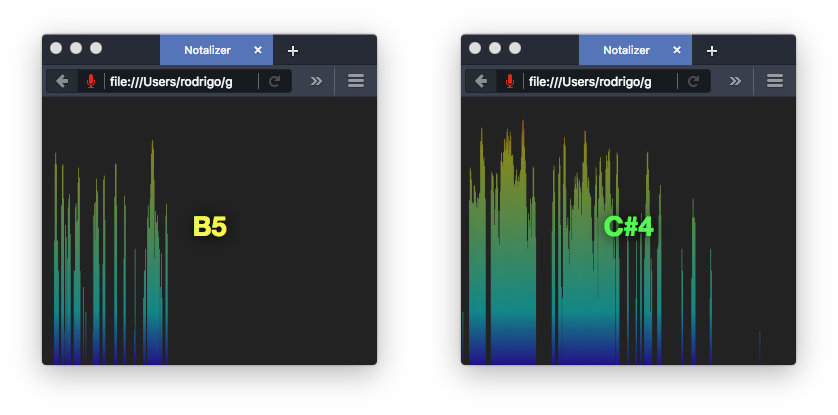

# Notalizer
A sound visualizer that displays frequency distribution and recognizes pitch as musical notes. Notalizer has a frequency domain of 100Hz to 3000 Hz, i.e. a range from G2 to F#7.

## Demo
Try out the demo at:
<https://rodrigoroarodriguez.github.io/Notalizer/>

## Installation
This package has no dependencies so far, but that will soon change. Right now this is a minimalistic proof-of-concept prototype, but I plan to rewrite this properly some time in the future as a react component/node module.

## Why doesn't Notalizer work with InternetExplorer and Safari?
Because these browsers do not support the [`MediaDevices.getUserMedia()`](https://developer.mozilla.org/en-US/docs/Web/API/MediaDevices/getUserMedia) API nor the older
[`Navigator.getUserMedia()`](https://developer.mozilla.org/en-US/docs/Web/API/Navigator/getUserMedia) legacy API.

## Frequency Thresholds
### Why doesn't Notalizer work with frequencies below 100Hz?
I honestly do not know. My suspicion is that it is a hardware limitation rather than a software issue. I suspect that my microphone does not operate correctly for frequencies below 100Hz.

### Why doesn't Notalizer work with frequencies above 3000Hz?
It is an arbitrary limit that you can change by messing with the `BIN_COUNT` variable (but be aware that this also increases the number of bars and takes a toll on performance). Personally, sounds over 3000Hz make my ears bleed (figuratively).
